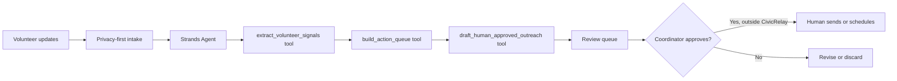

# CivicRelay architecture

The agent does not own a mail, calendar, chat, or scheduling credential. Its output is a reviewable recommendation and a draft, each linked to the incoming update that produced it.

## Strands execution

`app.py` imports `Agent` and `tool` from `strands`, giving the agent three narrow tools:

1. `extract_volunteer_signals` identifies availability and urgent constraints.
2. `build_action_queue` orders a small, reviewable coordination queue.
3. `draft_human_approved_outreach` prepares wording without sending it.

The default deterministic mode lets the complete project run without a cloud credential. To invoke a configured Strands model, set `CIVICRELAY_USE_STRANDS=1` and send `use_strands: true` to the API.
